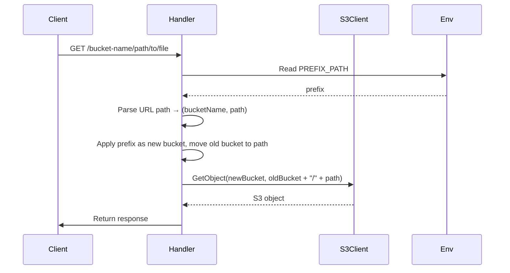

# Kế hoạch triển khai PREFIX_PATH (Cập nhật)

## Yêu cầu
Sử dụng PREFIX_PATH làm bucket mới và chuyển bucket cũ thành phần đầu của path

## Các bước thực hiện

1. **Sửa đổi file `api/s3.go`**
   ```go
   prefix := os.Getenv("PREFIX_PATH")
   if prefix != "" {
       prefix = strings.Trim(prefix, "/")
       // Tạo path mới: [prefix]/[bucket cũ]/[path cũ]
       newPath := bucketName
       if path != "" {
           newPath += "/" + path
       }
       bucketName = prefix
       path = newPath
   }
   ```

2. **Kiểm thử**
   - Đảm bảo test case `TestPrefixPathHandling` trong `api/s3_test.go` pass
   - Kiểm tra các trường hợp:
     - PREFIX_PATH rỗng
     - PREFIX_PATH có giá trị đơn
     - PREFIX_PATH có nhiều cấp
     - Các trường hợp biên

## Sequence Diagram (Cập nhật)


## Lưu ý
- Đảm bảo không ảnh hưởng đến các chức năng hiện có
- Cập nhật tài liệu nếu cần