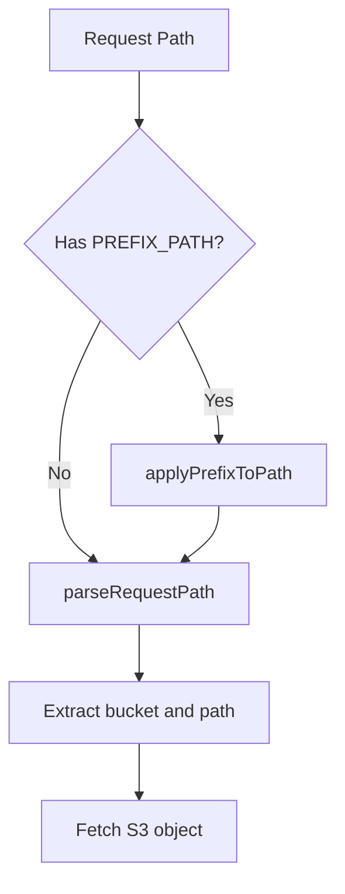

# Kế hoạch Refactor Xử lý Prefix Path (Clean Code)

## Nguyên tắc Clean Code áp dụng
1. **Single Responsibility Principle**: Mỗi hàm chỉ làm một nhiệm vụ
2. **Meaningful Names**: Đặt tên hàm rõ ràng, tự mô tả
3. **Test-Driven Development**: Viết test trước khi triển khai
4. **KISS (Keep It Simple)**: Logic đơn giản, dễ hiểu

## Kiến trúc mới


## Implementation

### 1. Hàm `applyPrefixToPath` mới (`api/s3.go`)
```go
// applyPrefixToPath áp dụng PREFIX_PATH vào request path nếu được cấu hình
// Trả về path mới đã được thêm prefix
func applyPrefixToPath(originalPath string) string {
    prefix := os.Getenv("PREFIX_PATH")
    if prefix == "" {
        return originalPath
    }
    
    // Chuẩn hóa prefix và path
    prefix = strings.Trim(prefix, "/")
    path := strings.TrimPrefix(originalPath, "/")
    
    // Kết hợp prefix và path
    return "/" + prefix + "/" + path
}
```

### 2. Cập nhật hàm Handler (`api/s3.go`)
```go
func Handler(w http.ResponseWriter, r *http.Request) {
    // Áp dụng prefix TRƯỚC KHI parse (tuân thủ SRP)
    prefixedPath := applyPrefixToPath(r.URL.Path)
    
    // Parse request path từ fullPath đã xử lý prefix
    bucket, path := parseRequestPath(prefixedPath)

    // Fetch S3 object (giữ nguyên)
    output, err := s3Client.GetObject(r.Context(), bucket, path,
        client.WithRangeHeader(r.Header.Get("Range")))
    if err != nil {
        http.Error(w, err.Error(), http.StatusInternalServerError)
        return
    }
    defer output.Body.Close()

    // ... (phần còn lại giữ nguyên)
}
```

### 3. Xóa hàm `applyPrefix`
- Hàm này không còn cần thiết

### 4. Cập nhật unit tests (`api/s3_test.go`)
```go
func TestApplyPrefixToPath(t *testing.T) {
    tests := []struct {
        name     string
        prefix   string
        input    string
        expected string
    }{
        {"No prefix", "", "/img.jpg", "/img.jpg"},
        {"Single segment", "my-bucket", "/img.jpg", "/my-bucket/img.jpg"},
        {"Multi segment", "bucket/folder", "/img.jpg", "/bucket/folder/img.jpg"},
        {"Edge: empty path", "bucket", "", "/bucket/"},
        {"Edge: root path", "bucket", "/", "/bucket/"},
        {"Edge: prefix with trailing slash", "bucket/", "/img.jpg", "/bucket/img.jpg"},
        {"Edge: path with multiple slashes", "bucket", "//img.jpg", "/bucket//img.jpg"},
    }

    for _, tt := range tests {
        t.Run(tt.name, func(t *testing.T) {
            os.Setenv("PREFIX_PATH", tt.prefix)
            result := applyPrefixToPath(tt.input)
            assert.Equal(t, tt.expected, result)
        })
    }
}

func TestHandlerWithPrefix(t *testing.T) {
    // Test case 1: With prefix
    os.Setenv("PREFIX_PATH", "my-bucket/prefix")
    req := httptest.NewRequest("GET", "/object-key", nil)
    handler := http.HandlerFunc(Handler)
    rr := httptest.NewRecorder()
    handler.ServeHTTP(rr, req)
    // Verify bucket = "my-bucket", path = "prefix/object-key"

    // Test case 2: Without prefix
    os.Unsetenv("PREFIX_PATH")
    req = httptest.NewRequest("GET", "/bucket/object", nil)
    rr = httptest.NewRecorder()
    handler.ServeHTTP(rr, req)
    // Verify bucket = "bucket", path = "object"
}
```

## Lợi ích Clean Code
1. **Tách biệt mối quan tâm**:
   - `applyPrefixToPath` chỉ xử lý prefix
   - `parseRequestPath` chỉ tách bucket/path
   - Dễ bảo trì và mở rộng

2. **Testability**:
   - Dễ dàng test riêng từng hàm
   - Test coverage cao hơn
   - Kiểm tra đầy đủ edge cases

3. **Code tự mô tả**:
   - Tên hàm rõ ràng: `applyPrefixToPath`, `parseRequestPath`
   - Comments giải thích mục đích

4. **Giảm độ phức tạp**:
   - Logic xử lý path đơn giản hơn
   - Mỗi hàm < 10 dòng code

## Kế hoạch triển khai
1. Cập nhật `api/s3.go` với hàm mới
2. Xóa hàm `applyPrefix` cũ
3. Thêm test cases trong `api/s3_test.go`
4. Chạy toàn bộ test suite
5. Kiểm tra hiệu năng