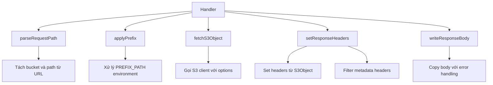

# Kế hoạch Refactor S3 Handler Function

## Mục tiêu
Tối ưu hàm `Handler` trong [`api/s3.go`](api/s3.go) bằng cách chia thành các hàm nhỏ hơn có chức năng cụ thể, đảm bảo clean code và nguyên tắc Single Responsibility.

## Phân tích hiện trạng
Hàm `Handler` hiện tại có 88 dòng code với nhiều trách nhiệm:
1. Xử lý URL path parsing (dòng 18-26)
2. Áp dụng PREFIX_PATH logic (dòng 28-53) 
3. Gọi S3 client để lấy object (dòng 54-58)
4. Thiết lập response headers (dòng 62-83)
5. Xử lý response body và error handling (dòng 86-102)

## Kiến trúc mới



## Chi tiết implementation

### 1. Hàm `parseRequestPath`
**Chức năng**: Tách URL path thành bucket name và object key
```go
func parseRequestPath(urlPath string) (bucket, path string) {
    path = strings.TrimPrefix(urlPath, "/")
    if i := strings.Index(path, "/"); i != -1 {
        return path[:i], path[i+1:]
    }
    return path, ""
}
```

### 2. Hàm `applyPrefix`
**Chức năng**: Áp dụng PREFIX_PATH environment variable
```go
func applyPrefix(bucket, path string) (newBucket, newPath string) {
    prefix := os.Getenv("PREFIX_PATH")
    if prefix == "" {
        return bucket, path
    }
    
    prefix = strings.Trim(prefix, "/")
    var prefixBucket, prefixPath string
    if i := strings.Index(prefix, "/"); i != -1 {
        prefixBucket = prefix[:i]
        prefixPath = prefix[i+1:]
    } else {
        prefixBucket = prefix
        prefixPath = ""
    }

    newPath = bucket
    if path != "" {
        newPath += "/" + path
    }
    if prefixPath != "" {
        newPath = prefixPath + "/" + newPath
    }

    return prefixBucket, newPath
}
```

### 3. Hàm `setResponseHeaders`
**Chức năng**: Thiết lập tất cả response headers từ S3Object
```go
func setResponseHeaders(w http.ResponseWriter, output *client.S3Object) {
    if output.ContentType != "" {
        w.Header().Set("Content-Type", output.ContentType)
    }
    if output.ContentLength > 0 {
        w.Header().Set("Content-Length", fmt.Sprintf("%d", output.ContentLength))
    }
    if output.ETag != "" {
        w.Header().Set("ETag", output.ETag)
    }
    if output.ContentRange != "" {
        w.Header().Set("Content-Range", output.ContentRange)
    }

    // Copy metadata headers với filtering
    for key, value := range output.Metadata {
        if strings.HasPrefix(strings.ToLower(key), "wasabi") ||
            strings.HasPrefix(strings.ToLower(value), "wasabi") {
            continue
        }
        w.Header().Set("x-amz-meta-"+key, value)
    }
}
```

### 4. Hàm `getStatusCode`
**Chức năng**: Xác định HTTP status code phù hợp
```go
func getStatusCode(output *client.S3Object) int {
    if output.ContentRange != "" {
        return http.StatusPartialContent
    }
    return output.StatusCode
}
```

### 5. Hàm `writeResponseBody`
**Chức năng**: Copy S3 object body với error handling
```go
func writeResponseBody(w http.ResponseWriter, r *http.Request, body io.ReadCloser) {
    if _, err := io.Copy(w, body); err != nil {
        // Chỉ log lỗi thực sự, không log khi client disconnect
        if r.Context().Err() == nil {
            log.Printf("Error copying S3 object body: %v", err)
        }
    }
}
```

### 6. Hàm `Handler` sau refactor
```go
func Handler(w http.ResponseWriter, r *http.Request) {
    // 1. Parse request path
    bucket, path := parseRequestPath(r.URL.Path)
    
    // 2. Apply prefix if configured
    bucket, path = applyPrefix(bucket, path)
    
    // 3. Fetch S3 object
    output, err := s3Client.GetObject(r.Context(), bucket, path, 
        client.WithRangeHeader(r.Header.Get("Range")))
    if err != nil {
        http.Error(w, err.Error(), http.StatusInternalServerError)
        return
    }
    defer output.Body.Close()
    
    // 4. Set response headers
    setResponseHeaders(w, output)
    
    // 5. Write status code and body
    w.WriteHeader(getStatusCode(output))
    writeResponseBody(w, r, output.Body)
}
```

## Cập nhật Test Cases

### Test cho các hàm mới
Tạo unit test riêng biệt trong [`api/s3_test.go`](api/s3_test.go):

1. `TestParseRequestPath` - Test path parsing logic
2. `TestApplyPrefix` - Test PREFIX_PATH handling  
3. `TestSetResponseHeaders` - Test header setting
4. `TestGetStatusCode` - Test status code logic
5. `TestWriteResponseBody` - Test body copying với mock

### Giữ nguyên Integration Tests
- `TestHandlerBasicRequest`
- `TestHandlerPathParsing` 
- `TestHandlerMetadataFiltering`
- `TestPrefixPathHandling`

## Lợi ích

### 1. Single Responsibility Principle
- Mỗi hàm chỉ có 1 trách nhiệm duy nhất
- Dễ hiểu và bảo trì

### 2. Testability
- Unit test cho từng thành phần riêng biệt
- Mock dependencies dễ dàng hơn

### 3. Code Reusability
- Các hàm con có thể tái sử dụng
- Logic business tách biệt khỏi HTTP handling

### 4. Maintainability  
- Giảm độ phức tạp từ 88 dòng xuống ~20 dòng trong hàm chính
- Thay đổi logic không ảnh hưởng toàn bộ handler

## Kế hoạch thực hiện

1. **Bước 1**: Tạo các hàm helper mới
2. **Bước 2**: Cập nhật hàm `Handler` để sử dụng helper functions
3. **Bước 3**: Thêm unit tests cho các hàm mới
4. **Bước 4**: Chạy toàn bộ test suite để đảm bảo không breaking changes
5. **Bước 5**: Code review và documentation

## Files cần thay đổi
- [`api/s3.go`](api/s3.go): Refactor hàm Handler
- [`api/s3_test.go`](api/s3_test.go): Thêm unit tests cho helper functions
